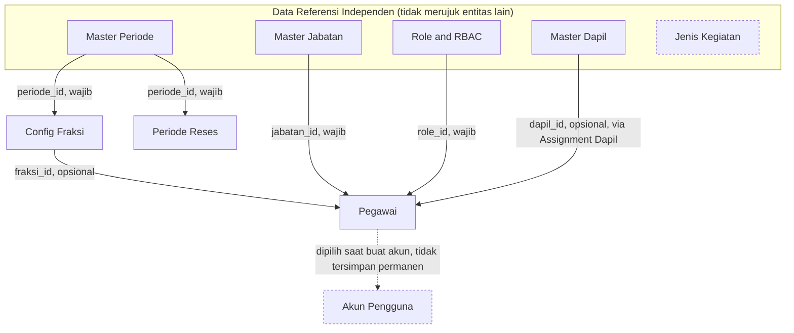
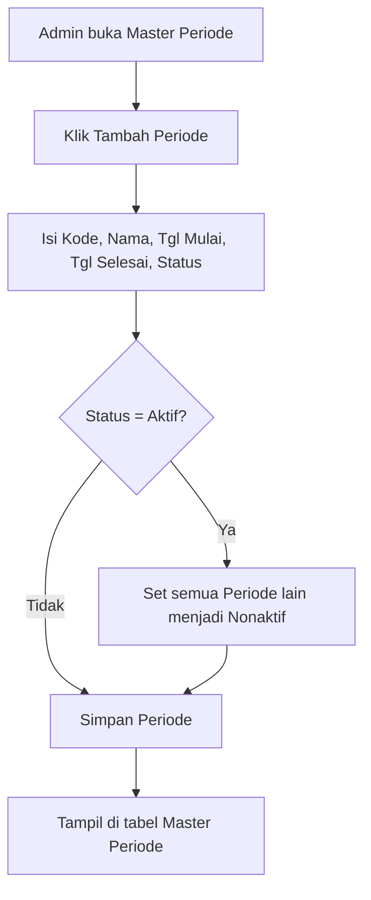
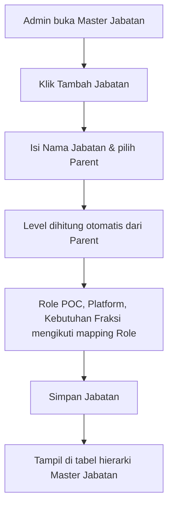
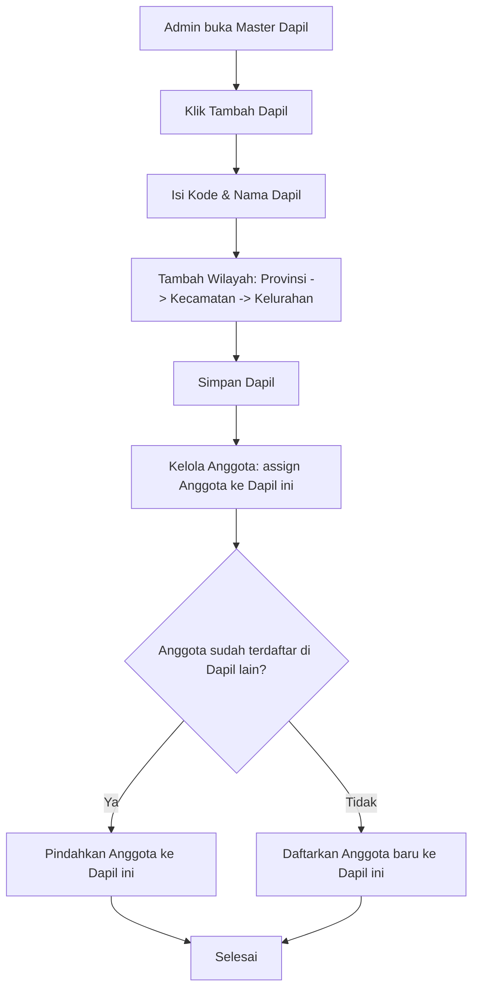
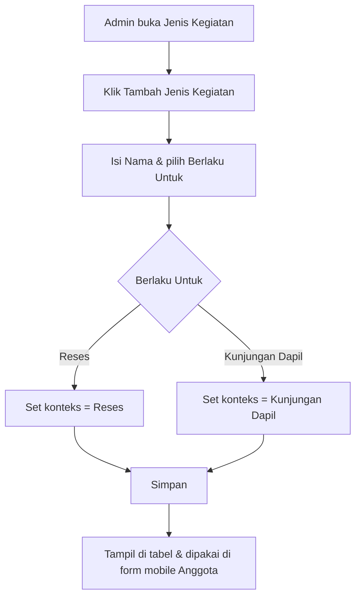
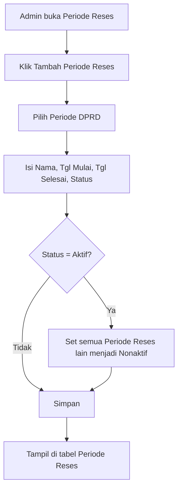
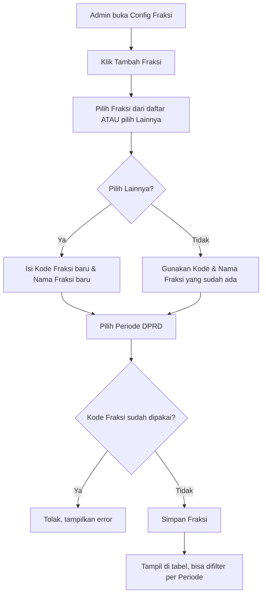
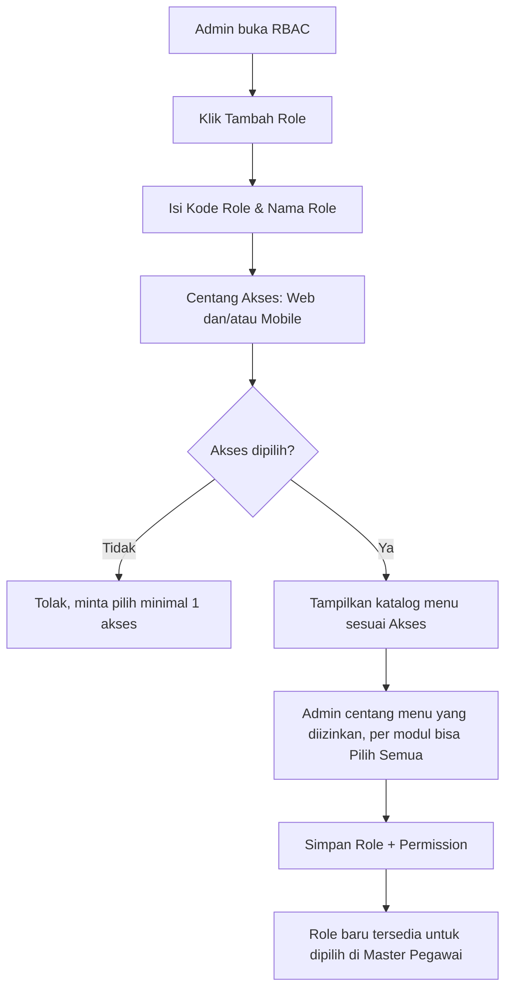
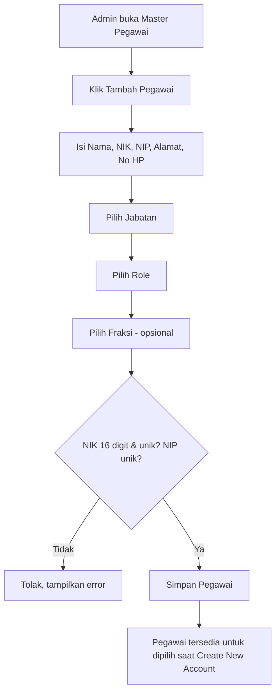
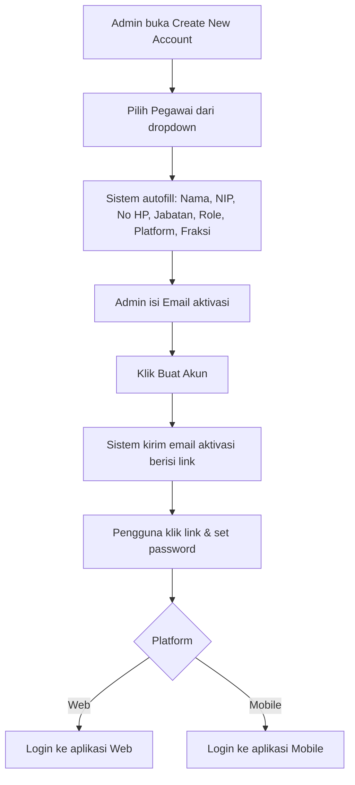

# SRS — Master Data e-Parlemen DPRD

*Per 8 Oktober 2026*

Dokumen ini juga tersedia sebagai Claude Doc (bisa diedit/dikomentari bersama tim): https://claude.ai/code/artifact/fd2cbb93-fb90-460c-9b09-b979110082a7

## Ringkasan

Dokumen ini adalah Software Requirements Specification (SRS) untuk seluruh modul **Master Data** yang sudah dibangun di prototipe e-Parlemen: Master Periode, Master Jabatan, Master Dapil, Jenis Kegiatan, Periode Reses, Config Fraksi, Role & RBAC, Pegawai, dan Akun Pengguna (Create New Account).

Setiap modul disajikan dengan format yang sama:

1. **Flowchart** — alur proses utama (tambah/edit/validasi), digambar sebagai diagram.
2. **Business Rules — Positif** — aturan yang harus dipenuhi sistem.
3. **Business Rules — Negatif** — batasan/larangan yang tidak boleh terjadi.
4. **Acceptance Criteria** — kondisi Given/When/Then untuk memverifikasi implementasi.

Di akhir dokumen terdapat tabel **Gap & Pertanyaan** yang merangkum asumsi/kekosongan pada prototipe saat ini dan pertanyaan yang perlu dikonfirmasi ke klien DPRD sebelum pengembangan lanjutan.

## Relasi Antar Master Data

Diagram berikut menunjukkan bagaimana seluruh modul Master Data saling terhubung (foreign key), termasuk relasi yang **belum terhubung** di prototipe saat ini (ditandai garis putus-putus merah).

### Penjelasan Relasi

- **Master Periode → Config Fraksi** (`periode_id`, wajib): setiap Fraksi harus terikat ke satu Periode DPRD.
- **Master Periode → Periode Reses** (`periode_id`, wajib): setiap Periode Reses harus terikat ke satu Periode DPRD.
- **Master Jabatan → Pegawai** (`jabatan_id`, wajib): setiap Pegawai harus punya satu Jabatan.
- **Role & RBAC → Pegawai** (`role_id`, wajib): setiap Pegawai harus punya satu Role, yang juga menentukan Platform aksesnya.
- **Config Fraksi → Pegawai** (`fraksi_id`, opsional): hanya wajib untuk Pegawai yang Role-nya membutuhkan afiliasi fraksi.
- **Master Dapil → Pegawai** (`dapil_id`, opsional): setiap Pegawai dapat ditugaskan ke satu Dapil; satu Dapil dapat memiliki banyak Pegawai. Dikelola lewat "Kelola Pegawai" di Master Dapil maupun halaman khusus **Assignment Dapil** (`master-assignment-dapil.html`) yang menampilkan kartu per Dapil beserta daftar Pegawai yang belum ter-assign. Meng-assign Pegawai yang sudah memiliki Dapil otomatis memindahkannya.

### Gap pada Relasi (perlu dikonfirmasi ke klien)

- **✅ Resolved — Anggota (Master Dapil) vs Pegawai**: Master Dapil dan Pegawai sekarang berbagi data yang sama melalui field `dapilId` pada Pegawai (`pegawai-data.js`), dengan modul **Assignment Dapil** (`master-assignment-dapil.html`) sebagai halaman dedicated untuk mengelola penugasan Pegawai ke Dapil. Tidak ada lagi dataset "Anggota" yang terpisah.
- **Pegawai → Akun Pengguna** (garis putus-putus): pemilihan Pegawai saat membuat akun hanya dipakai untuk autofill form; prototipe ini **tidak menyimpan** relasi akun-ke-pegawai sebagai data permanen (tidak ada tabel Akun Pengguna yang persisten). Perlu dirancang skema `akun_pengguna` dengan `pegawai_id` sebagai FK sungguhan.
- **Jenis Kegiatan**: tidak memiliki relasi ke entitas Master manapun saat ini (sempat dirancang terhubung ke Dapil, lalu dilepas).

## 1. Master Periode

### Flowchart

### Business Rules — Positif

- Setiap Periode memiliki Kode unik, Nama, Tanggal Mulai, Tanggal Selesai, dan Status (Aktif/Nonaktif).
- Mengaktifkan satu Periode otomatis menonaktifkan seluruh Periode lain (exactly-one-active).
- Data Periode menjadi rujukan (foreign key) bagi Config Fraksi dan Periode Reses.

### Business Rules — Negatif

- Admin tidak boleh membuat dua Periode dengan Kode yang sama.
- Sistem tidak boleh membiarkan lebih dari satu Periode berstatus Aktif pada waktu yang sama.
- Periode tidak boleh dihapus jika masih dirujuk oleh data lain (Fraksi/Periode Reses) — *lihat Gap*.

### Acceptance Criteria

- **Given** tidak ada Periode Aktif, **When** admin menambah Periode baru dengan Status = Aktif, **Then** Periode tersebut tersimpan sebagai satu-satunya Periode Aktif.
- **Given** Periode A berstatus Aktif, **When** admin mengaktifkan Periode B, **Then** Periode A otomatis berubah menjadi Nonaktif dan Periode B menjadi Aktif.
- **Given** Kode Periode "PRD-2024" sudah ada, **When** admin menyimpan Periode baru dengan Kode yang sama, **Then** sistem menolak dan menampilkan pesan error.

### Business Rules per Tombol/Fungsi

- **Tombol "Tambah Periode"**: reset form kosong, Status default "Aktif", buka modal mode Tambah.
- **Tombol "Edit" (per baris)**: isi form dengan data baris terpilih, buka modal mode Edit.
- **Tombol "Simpan" (submit form)**: validasi semua field wajib terisi; validasi Kode Periode unik (case-insensitive) kecuali baris yang sedang diedit; jika Status = "Aktif" maka seluruh Periode lain otomatis diset "Nonaktif" sebelum disimpan; simpan ke localStorage, render ulang tabel, tutup modal, tampilkan toast konfirmasi.
- **Tombol "Batal"**: tutup modal tanpa menyimpan perubahan apa pun.

### Aturan Field (Validasi & Sumber Data)

| Field | Tipe | Mandatory | Max Length / Format | Sumber Data | Negative Case |
| --- | --- | --- | --- | --- | --- |
| Kode Periode | text | Ya | bebas, disarankan "PRD-YYYY" | input manual | kosong → ditolak; duplikat dengan Periode lain → ditolak ("Kode Periode sudah digunakan") |
| Nama Periode | text | Ya | bebas | input manual | kosong → ditolak |
| Tanggal Mulai | date | Ya | format tanggal valid | date picker browser | kosong → ditolak; Tanggal Mulai > Tanggal Selesai belum divalidasi — *lihat Gap* |
| Tanggal Selesai | date | Ya | format tanggal valid | date picker browser | kosong → ditolak |
| Status | select | Ya | Aktif / Nonaktif | pilihan statis | selalu ada nilai default, tidak bisa kosong |

## 2. Master Jabatan

### Flowchart

### Business Rules — Positif

- Jabatan memiliki struktur hierarki (Parent-Child); Level dihitung otomatis dari Parent yang dipilih.
- Setiap Jabatan memetakan ke Role POC, Platform akses, dan kebutuhan Fraksi secara otomatis berdasarkan aturan tetap.

### Business Rules — Negatif

- Admin tidak boleh mengubah Level secara manual (bersifat read-only, hasil turunan dari Parent).
- Jabatan dengan Role POC "Administrator" tidak boleh mewajibkan Fraksi.
- Jabatan tidak boleh memiliki Parent yang membentuk siklus (circular reference) — *lihat Gap*.

### Acceptance Criteria

- **Given** Jabatan "Anggota DPRD" memiliki Parent "Wakil Ketua DPRD" (Level 2), **When** disimpan, **Then** Level Jabatan tersebut otomatis menjadi 3.
- **Given** Jabatan dengan Role POC = Administrator, **When** form ditampilkan, **Then** field "Fraksi" otomatis bernilai "Tidak" dan tidak bisa diubah.

### Business Rules per Tombol/Fungsi

- **Tombol "Tambah Jabatan"**: reset form, buka modal mode Tambah.
- **Tombol "Edit" (per baris)**: isi form dengan data baris termasuk Parent & Level, buka modal mode Edit.
- **Event onchange pada Role (fRole)**: otomatis mengisi Platform & Fraksi sesuai mapping tetap (Ketua → Web/Ya, Administrator → Web/Tidak, Anggota → Mobile/Ya); kedua field langsung terkunci (readonly), admin tidak bisa override manual.
- **Event onchange pada Parent (fParent)**: otomatis menghitung ulang Level = Level Parent + 1 (atau 1 jika tanpa Parent).
- **Tombol "Simpan"**: validasi Nama Jabatan, Keterangan, Role, Status wajib terisi; simpan beserta Platform/Fraksi/Level yang sudah diturunkan otomatis; render ulang tabel hierarki, tutup modal, toast konfirmasi.
- **Tombol "Batal"**: tutup modal tanpa menyimpan.

### Aturan Field (Validasi & Sumber Data)

| Field | Tipe | Mandatory | Max Length / Format | Sumber Data | Negative Case |
| --- | --- | --- | --- | --- | --- |
| Nama Jabatan | text | Ya | bebas | input manual | kosong → ditolak |
| Keterangan | text | Ya | bebas | input manual | kosong → ditolak |
| Role POC | select | Ya | Ketua / Administrator / Anggota | pilihan statis | - |
| Platform | readonly text | otomatis | Web / Mobile | diturunkan dari Role (mapping tetap) | tidak bisa diedit manual |
| Fraksi | readonly text | otomatis | Ya / Tidak | diturunkan dari Role (mapping tetap) | tidak bisa diedit manual |
| Parent | select | Tidak (opsional, kosong = Level 1) | daftar Jabatan lain | data Jabatan yang sudah ada | validasi siklus Parent belum ada — *lihat Gap* |
| Level | readonly number | otomatis | — | dihitung dari Level Parent + 1 | tidak bisa diedit manual |
| Status | select | Ya | Aktif / Nonaktif | pilihan statis | - |

## 3. Master Dapil

### Flowchart

### Business Rules — Positif

- Satu Dapil dapat memiliki banyak Anggota DPRD.
- Dapil memiliki struktur wilayah bertingkat (Provinsi → Kecamatan → Kelurahan/Desa).

### Business Rules — Negatif

- Satu Anggota DPRD tidak boleh terdaftar di lebih dari satu Dapil sekaligus — memilihnya di Dapil baru otomatis memindahkan dari Dapil lama.
- Dapil tidak boleh disimpan tanpa minimal satu wilayah (Kecamatan + Kelurahan).

### Acceptance Criteria

- **Given** Anggota "Budi" terdaftar di Dapil 1, **When** admin menandai Budi di Dapil 2, **Then** Budi otomatis terhapus dari daftar Anggota Dapil 1.
- **Given** form Tambah Dapil belum memiliki wilayah, **When** admin klik Simpan, **Then** sistem menolak dan meminta minimal 1 wilayah.

### Business Rules per Tombol/Fungsi

- **Tombol "Tambah Dapil"**: reset form (termasuk staging wilayah kosong), buka modal.
- **Tombol "Tambah Wilayah"**: menambahkan kombinasi Kecamatan + Kelurahan terpilih ke staging list; menolak jika kombinasi sudah ada di staging ("Wilayah tersebut sudah ditambahkan").
- **Tombol hapus (x) pada chip wilayah staging**: menghapus satu entri wilayah dari staging.
- **Tombol "Simpan" (form utama)**: validasi Kode & Nama wajib terisi; validasi staging wilayah tidak boleh kosong (minimal 1); jika Kode diubah saat edit dan ada Anggota yang mereferensikan Kode lama, Anggota tersebut ikut dipindahkan ke Kode baru.
- **Tombol "Kelola Anggota" (per baris)**: membuka modal checklist Anggota; mencentang Anggota memindahkannya ke Dapil ini (otomatis lepas dari Dapil sebelumnya jika ada); tombol "Simpan" pada modal ini menampilkan ringkasan jumlah yang dipindahkan/dihapus.
- **Tombol "Edit" (per baris)**: isi form + staging wilayah dengan data baris, buka modal mode Edit.
- **Tombol "Batal"**: tutup modal tanpa menyimpan.

### Aturan Field (Validasi & Sumber Data)

| Field | Tipe | Mandatory | Max Length / Format | Sumber Data | Negative Case |
| --- | --- | --- | --- | --- | --- |
| Kode Dapil | text | Ya | bebas, mis. "DAPIL-1" | input manual | kosong → ditolak |
| Nama Dapil | text | Ya | bebas | input manual | kosong → ditolak |
| Provinsi | select | Ya (untuk menambah wilayah) | daftar provinsi statis | data wilayah hardcoded | - |
| Kecamatan | select | Ya (untuk menambah wilayah) | tergantung Provinsi terpilih | data wilayah hardcoded | disabled sampai Provinsi dipilih |
| Kelurahan | select | Ya (untuk menambah wilayah) | tergantung Kecamatan terpilih | data wilayah hardcoded | disabled sampai Kecamatan dipilih |
| Wilayah (staging) | daftar chip | Ya, minimal 1 | — | hasil tombol "Tambah Wilayah" | kosong saat Simpan → ditolak ("Tambahkan minimal satu wilayah") |
| Status | select | Ya | Aktif / Nonaktif | pilihan statis | - |
| Anggota (checklist Kelola Anggota) | checkbox | Tidak wajib (boleh 0) | — | data Anggota | satu Anggota hanya boleh tercentang di 1 Dapil (otomatis pindah) |

## 4. Jenis Kegiatan

### Flowchart

### Business Rules — Positif

- Setiap Jenis Kegiatan memiliki tepat satu konteks penggunaan: Reses atau Kunjungan Dapil.
- Status Aktif/Nonaktif menentukan apakah Jenis Kegiatan muncul di form pencatatan mobile.

### Business Rules — Negatif

- Jenis Kegiatan tidak boleh berlaku untuk Reses dan Kunjungan Dapil secara bersamaan (single-select, bukan multi-select).
- Jenis Kegiatan berstatus Nonaktif tidak boleh muncul sebagai opsi di form pencatatan kegiatan Anggota (mobile) — *lihat Gap*.

### Acceptance Criteria

- **Given** admin memilih "Reses" di field Berlaku Untuk, **When** disimpan, **Then** Jenis Kegiatan tidak bisa sekaligus tercatat untuk Kunjungan Dapil.
- **Given** Jenis Kegiatan "Sosialisasi" berstatus Nonaktif, **When** Anggota membuka form pencatatan reses di mobile, **Then** "Sosialisasi" tidak muncul di pilihan.

### Business Rules per Tombol/Fungsi

- **Tombol "Tambah Jenis Kegiatan"**: reset form, buka modal.
- **Tombol "Edit" (per baris)**: isi form dengan Nama, Berlaku Untuk, Status dari baris terpilih.
- **Tombol "Simpan"**: validasi Nama wajib terisi; Berlaku Untuk wajib dipilih tepat satu nilai (dropdown single-select, tidak ada kombinasi ganda); simpan, render ulang tabel, tutup modal, toast konfirmasi.
- **Tombol "Batal"**: tutup modal tanpa menyimpan.

### Aturan Field (Validasi & Sumber Data)

| Field | Tipe | Mandatory | Max Length / Format | Sumber Data | Negative Case |
| --- | --- | --- | --- | --- | --- |
| Nama Jenis Kegiatan | text | Ya | bebas | input manual | kosong → ditolak |
| Berlaku Untuk | select | Ya | Reses / Kunjungan Dapil (pilih satu) | pilihan statis | tidak mungkin memilih keduanya karena dropdown single-value |
| Status | select | Ya | Aktif / Nonaktif | pilihan statis | - |

## 5. Periode Reses

### Flowchart

### Business Rules — Positif

- Setiap Periode Reses wajib terhubung ke satu Periode DPRD (periode_id, relasi wajib).
- Mengaktifkan satu Periode Reses otomatis menonaktifkan Periode Reses lain (mengikuti pola Master Periode).

### Business Rules — Negatif

- Periode Reses tidak boleh dibuat tanpa memilih Periode DPRD induknya.
- Tidak boleh ada lebih dari satu Periode Reses berstatus Aktif secara bersamaan — *lihat Gap*.

### Acceptance Criteria

- **Given** Periode Reses "Reses III Tahun 2026" berstatus Aktif, **When** admin mengaktifkan "Reses I Tahun 2027", **Then** "Reses III Tahun 2026" otomatis menjadi Nonaktif.
- **Given** form Tambah Periode Reses, **When** admin tidak memilih Periode DPRD, **Then** sistem menolak simpan.

### Business Rules per Tombol/Fungsi

- **Tombol "Tambah Periode Reses"**: reset form, pilihan Periode DPRD default ke item pertama, buka modal.
- **Tombol "Edit" (per baris)**: isi form dengan data baris, buka modal mode Edit.
- **Tombol "Hapus" (per baris)**: membuka modal konfirmasi terpisah menampilkan nama Periode Reses yang akan dihapus; tombol "Hapus" di modal ini menghapus permanen dari localStorage dan menampilkan toast; tombol "Batal" membatalkan.
- **Tombol "Simpan" (form utama)**: validasi Periode DPRD, Nama, Tanggal Mulai, Tanggal Selesai, Status wajib terisi; jika Status = "Aktif" maka seluruh Periode Reses lain (lintas Periode DPRD apa pun) otomatis diset "Nonaktif"; simpan, render ulang tabel & statistik, tutup modal, toast konfirmasi.
- **Tombol "Batal"**: tutup modal tanpa menyimpan.

### Aturan Field (Validasi & Sumber Data)

| Field | Tipe | Mandatory | Max Length / Format | Sumber Data | Negative Case |
| --- | --- | --- | --- | --- | --- |
| Periode DPRD | select | Ya | daftar Periode Aktif/Nonaktif | Master Periode (periode-data.js) | tidak boleh kosong — relasi wajib |
| Nama Periode Reses | text | Ya | bebas, mis. "Reses I Tahun 2026" | input manual | kosong → ditolak |
| Tanggal Mulai | date | Ya | format tanggal valid | date picker | kosong → ditolak |
| Tanggal Selesai | date | Ya | format tanggal valid | date picker | kosong → ditolak |
| Status | select | Ya | Aktif / Nonaktif | pilihan statis | - |

## 6. Config Fraksi

### Flowchart

### Business Rules — Positif

- Fraksi memiliki Kode unik, Nama, dan terhubung ke satu Periode DPRD.
- Admin dapat memilih Fraksi existing atau membuat baru ("Lainnya") dalam satu alur yang sama.
- Daftar Fraksi dapat difilter per Periode, default ke Periode yang sedang Aktif.

### Business Rules — Negatif

- Fraksi tidak boleh memiliki Kode yang sama dengan Fraksi lain (kecuali sedang mengedit dirinya sendiri).
- Fraksi tidak memiliki relasi ke Partai politik maupun field Status Aktif/Nonaktif (dihapus dari rancangan atas keputusan eksplisit) — *lihat Gap*.

### Acceptance Criteria

- **Given** Kode "FRK-01" sudah ada, **When** admin menambah Fraksi baru dengan Kode "FRK-01", **Then** sistem menolak dan menampilkan pesan error.
- **Given** admin memilih "Lainnya" di dropdown Fraksi, **When** mengetik Kode & Nama baru dan menyimpan, **Then** Fraksi baru tersebut langsung tersedia untuk dipilih di percobaan Tambah Fraksi berikutnya.
- **Given** filter Periode diset ke Periode Aktif, **When** halaman dimuat, **Then** hanya Fraksi milik Periode tersebut yang tampil di tabel.

### Business Rules per Tombol/Fungsi

- **Filter "Filter Periode" (dropdown di atas tabel)**: menyaring tabel & kartu statistik Total Fraksi agar hanya menampilkan Fraksi milik Periode terpilih; default terisi ke Periode yang berstatus Aktif saat halaman dimuat; pilihan "Semua Periode" menampilkan seluruh data.
- **Tombol "Tambah Fraksi"**: reset form (field Kode/Nama baru tersembunyi), buka modal.
- **Event onchange pada pilihan Fraksi**: jika memilih "Lainnya (tambah fraksi baru)", field Kode Fraksi & Nama Fraksi baru ditampilkan dan menjadi wajib; jika memilih Fraksi existing, kedua field tersembunyi dan tidak wajib.
- **Tombol "Edit" (per baris)**: form terisi dengan Fraksi = dirinya sendiri (existing), Periode = Periode fraksi tersebut.
- **Tombol "Hapus" (per baris)**: modal konfirmasi terpisah, menghapus permanen setelah dikonfirmasi.
- **Tombol "Simpan"**: jika memilih Fraksi existing, pakai Kode & Nama dari Fraksi tersebut; jika memilih "Lainnya", validasi Kode & Nama Fraksi baru wajib terisi; validasi Kode Fraksi (existing maupun baru) tidak boleh duplikat dengan Fraksi lain (kecuali dirinya sendiri saat edit); validasi Periode DPRD wajib dipilih; simpan, render ulang tabel (mengikuti filter aktif) & statistik, tutup modal, toast konfirmasi.
- **Tombol "Batal"**: tutup modal tanpa menyimpan.

### Aturan Field (Validasi & Sumber Data)

| Field | Tipe | Mandatory | Max Length / Format | Sumber Data | Negative Case |
| --- | --- | --- | --- | --- | --- |
| Fraksi (pilihan) | select | Ya | daftar Fraksi existing + "Lainnya" | fraksi-data.js (localStorage) | selalu ada default, tidak mungkin kosong |
| Kode Fraksi baru | text | Ya, hanya jika pilih "Lainnya" | bebas, mis. "FRK-06" | input manual | kosong saat "Lainnya" dipilih → ditolak; duplikat dengan Kode lain → ditolak |
| Nama Fraksi baru | text | Ya, hanya jika pilih "Lainnya" | bebas | input manual | kosong saat "Lainnya" dipilih → ditolak |
| Periode DPRD | select | Ya | daftar Periode | periode-data.js | tidak boleh kosong |
| Filter Periode | select | Tidak (filter tampilan, bukan form simpan) | "Semua Periode" + daftar Periode | periode-data.js | - |

## 7. Role & RBAC

### Flowchart

### Business Rules — Positif

- Role bersifat custom: Kode, Nama, dan Akses (Web/Mobile/keduanya) ditentukan admin, bukan daftar baku.
- Katalog menu RBAC otomatis menyesuaikan Akses yang dipilih (Web dan/atau Mobile menampilkan menu masing-masing).
- Tiap modul menu punya kontrol "Pilih Semua" untuk mempercepat konfigurasi.

### Business Rules — Negatif

- Role tidak boleh disimpan tanpa minimal satu Akses (Web atau Mobile) dipilih.
- Role tidak boleh memiliki Kode yang duplikat dengan Role lain.
- Belum ada permission khusus yang menjaga siapa boleh mengelola RBAC itu sendiri — *lihat Gap*.

### Acceptance Criteria

- **Given** tidak ada Akses dicentang, **When** admin klik Simpan, **Then** sistem menolak dan menampilkan pesan error.
- **Given** Akses "Mobile" dicentang, **When** form menu ditampilkan, **Then** hanya katalog menu Mobile yang muncul untuk dicentang.
- **Given** admin mencentang "Pilih Semua" pada modul "Master Data", **When** disimpan, **Then** seluruh menu dalam modul tersebut masuk ke daftar permission Role.

### Business Rules per Tombol/Fungsi

- **Tombol "Tambah Role"**: navigasi ke halaman penuh terpisah (bukan modal), form kosong.
- **Checkbox Akses Web / Mobile (onchange)**: menampilkan/menyembunyikan blok daftar menu sesuai platform yang dicentang; mencentang lebih dari satu akses menampilkan kedua blok menu sekaligus.
- **Checkbox "Pilih Semua" per modul menu**: mencentang/mengosongkan seluruh item menu dalam modul tersebut sekaligus; otomatis tercentang sendiri jika semua item di bawahnya sudah dicentang manual satu per satu.
- **Tombol "Pilih Semua" / "Kosongkan" (global)**: mencentang/mengosongkan seluruh menu yang sedang ditampilkan (lintas modul & platform yang aktif).
- **Tombol "Edit" (per baris, di halaman list)**: membuka modal terisi Kode, Nama, Akses, dan permission menu yang sudah tersimpan untuk Role tersebut.
- **Tombol "Simpan"**: validasi Kode & Nama Role wajib terisi; validasi minimal satu Akses (Web/Mobile) dicentang; validasi Kode Role tidak boleh duplikat dengan Role lain (kecuali dirinya sendiri saat edit); simpan Role beserta daftar ID menu yang dicentang sebagai permission; di halaman Tambah (terpisah) redirect ke list RBAC dengan toast sukses, di modal Edit tutup modal + render ulang tabel + toast sukses.
- **Tombol "Batal"**: di halaman Tambah kembali ke list tanpa menyimpan; di modal Edit menutup modal tanpa menyimpan.

### Aturan Field (Validasi & Sumber Data)

| Field | Tipe | Mandatory | Max Length / Format | Sumber Data | Negative Case |
| --- | --- | --- | --- | --- | --- |
| Kode Role | text | Ya | bebas, mis. "ROL-04" | input manual | kosong → ditolak; duplikat → ditolak ("Kode Role sudah digunakan") |
| Nama Role | text | Ya | bebas | input manual | kosong → ditolak |
| Akses Web | checkbox | Minimal 1 dari 2 (Web/Mobile) wajib | — | pilihan statis | keduanya tidak dicentang → ditolak ("Pilih minimal satu Akses") |
| Akses Mobile | checkbox | Minimal 1 dari 2 (Web/Mobile) wajib | — | pilihan statis | idem di atas |
| Menu per modul | checkbox | Tidak wajib (boleh 0 menu) | — | katalog menu Web/Mobile (rbac-data.js) | Role tanpa menu tercentang tetap bisa disimpan — *perlu konfirmasi, lihat Gap* |

## 8. Pegawai

### Flowchart

### Business Rules — Positif

- Satu record Pegawai menyimpan identitas lengkap: Nama, NIK, NIP, Alamat, No HP, Jabatan, Role, Fraksi (opsional).
- Fraksi opsional khusus untuk Role yang tidak membutuhkan afiliasi fraksi.

### Business Rules — Negatif

- NIK wajib tepat 16 digit angka dan unik di seluruh sistem.
- NIP wajib unik di seluruh sistem.
- Pegawai tidak boleh disimpan tanpa Jabatan dan Role.

### Acceptance Criteria

- **Given** admin mengisi NIK dengan 15 digit, **When** klik Simpan, **Then** sistem menolak dan meminta NIK 16 digit.
- **Given** NIP "DPRD-AGT-0044" sudah terdaftar, **When** admin menyimpan Pegawai baru dengan NIP yang sama, **Then** sistem menolak.
- **Given** Role Pegawai = Administrator, **When** form ditampilkan, **Then** field Fraksi tetap bisa dikosongkan tanpa error validasi.

### Business Rules per Tombol/Fungsi

- **Tombol "Tambah Pegawai"**: reset form, buka modal.
- **Tombol "Edit" (per baris)**: isi seluruh field dengan data baris terpilih.
- **Tombol "Hapus" (per baris)**: modal konfirmasi terpisah, menghapus permanen setelah dikonfirmasi.
- **Tombol "Simpan"**: validasi Nama, NIK, NIP, Alamat, No. HP, Jabatan, Role wajib terisi (Fraksi opsional); validasi format NIK harus tepat 16 digit angka; validasi NIK unik (tidak boleh sama dengan Pegawai lain, kecuali dirinya sendiri saat edit); validasi NIP unik (case-insensitive, idem); simpan, render ulang tabel & statistik, tutup modal, toast konfirmasi.
- **Tombol "Batal"**: tutup modal tanpa menyimpan.

### Aturan Field (Validasi & Sumber Data)

| Field | Tipe | Mandatory | Max Length / Format | Sumber Data | Negative Case |
| --- | --- | --- | --- | --- | --- |
| Nama Lengkap | text | Ya | bebas | input manual | kosong → ditolak |
| NIK | text (numeric) | Ya | tepat 16 digit angka (maxlength=16) | input manual | selain 16 digit angka → ditolak ("NIK harus 16 digit angka"); duplikat dengan Pegawai lain → ditolak |
| NIP | text | Ya | bebas, mis. "DPRD-AGT-0044" | input manual | kosong → ditolak; duplikat dengan Pegawai lain → ditolak |
| Alamat | textarea | Ya | bebas | input manual | kosong → ditolak |
| No. HP | text | Ya | bebas | input manual | kosong → ditolak |
| Jabatan | select | Ya | daftar Jabatan | jabatan-data.js | tidak boleh kosong |
| Role | select | Ya | daftar Role | rbac-data.js | tidak boleh kosong |
| Fraksi | select | Tidak (opsional) | daftar Fraksi + "Tidak Ada" | fraksi-data.js | boleh dikosongkan (khususnya Role tanpa kebutuhan fraksi) |

## 9. Akun Pengguna (Create New Account)

### Flowchart

### Business Rules — Positif

- Pembuatan akun selalu dimulai dari memilih Pegawai; seluruh data identitas/role/akses otomatis mengikuti data Pegawai.
- Sistem mengirim email aktivasi berisi tautan untuk set password sebelum login pertama kali.

### Business Rules — Negatif

- Admin tidak boleh membuat akun tanpa memilih Pegawai terlebih dahulu.
- Admin tidak boleh mengubah manual Jabatan/Role/Platform/Fraksi di form pembuatan akun — field tersebut read-only, bersumber dari Master Pegawai.
- Pengguna tidak boleh login sebelum proses aktivasi (set password) selesai — *lihat Gap*.

### Acceptance Criteria

- **Given** admin memilih Pegawai "Siti Rahmawati" (Role = Administrator), **When** form dimuat, **Then** field Platform Akses otomatis terisi "Web" dan tidak bisa diedit.
- **Given** Email aktivasi diisi dan tombol Buat Akun diklik, **Then** sistem menampilkan konfirmasi akun berhasil dibuat beserta pratinjau email aktivasi.
- **Given** Pegawai belum dipilih, **When** admin klik Buat Akun, **Then** sistem menolak submit.

### Business Rules per Tombol/Fungsi

- **Event onchange pada "Pilih Pegawai"**: mengambil data Pegawai terpilih dari Master Pegawai, mengisi otomatis Nama, NIP, No. HP, Jabatan, Role POC, Platform Akses (gabungan Akses Role, dipisah koma jika lebih dari satu), dan Fraksi (atau teks "Tidak diperlukan" jika Pegawai tidak memiliki Fraksi); mengganti teks hint Email sesuai platform.
- **Tombol "Buat Akun & Kirim Aktivasi" (submit)**: validasi Pegawai wajib dipilih; validasi Email wajib terisi dan berformat email valid; mengambil Role & Platform dari Pegawai terpilih (bukan dari input manual); mengganti tampilan ke halaman konfirmasi sukses + pratinjau email aktivasi (simulasi, tidak benar-benar mengirim email).
- Seluruh field hasil autofill (Nama, NIP, No. HP, Jabatan, Role POC, Platform Akses, Fraksi) bersifat **read-only** — tidak ada tombol/event untuk mengeditnya langsung di halaman ini.

### Aturan Field (Validasi & Sumber Data)

| Field | Tipe | Mandatory | Max Length / Format | Sumber Data | Negative Case |
| --- | --- | --- | --- | --- | --- |
| Pilih Pegawai | select | Ya | daftar Pegawai | pegawai-data.js | kosong → tidak bisa submit (required) |
| Nama Lengkap | readonly text | otomatis | — | dari record Pegawai terpilih | tidak bisa diedit manual |
| NIP | readonly text | otomatis | — | dari record Pegawai terpilih | tidak bisa diedit manual |
| No. HP | readonly text | otomatis | — | dari record Pegawai terpilih | tidak bisa diedit manual |
| Jabatan | readonly text | otomatis | — | jabatan-data.js via Pegawai.jabatanId | tidak bisa diedit manual |
| Role POC | readonly text | otomatis | — | rbac-data.js via Pegawai.roleId | tidak bisa diedit manual |
| Platform Akses | readonly text | otomatis | — | Role.akses | tidak bisa diedit manual |
| Fraksi | readonly text | otomatis | — | fraksi-data.js via Pegawai.fraksiId | menampilkan "Tidak diperlukan" jika Pegawai tidak punya Fraksi |
| Email Aktivasi | email | Ya | format email valid | input manual | kosong atau format salah → ditolak oleh validasi HTML5 |

## Gap & Pertanyaan yang Perlu Ditanyakan

| Modul | Gap / Asumsi di Prototipe | Pertanyaan ke Klien |
| --- | --- | --- |
| Master Periode | Tidak ada fitur Hapus Periode | Apakah Periode DPRD perlu bisa dihapus, atau cukup diarsipkan (Nonaktif permanen)? |
| Master Periode | Belum ada aturan siapa berwenang mengaktifkan Periode | Siapa role yang boleh mengubah Periode Aktif — Administrator saja, atau perlu approval? |
| Master Jabatan | Validasi siklus Parent-Child belum pasti ada | Apakah perlu validasi agar hierarki Jabatan tidak membentuk siklus (circular parent)? |
| Master Jabatan | Hierarki hanya mencakup 5 jabatan | Apakah ada jabatan lain (Ketua Komisi, Ketua Fraksi, Bendahara) yang perlu ditambahkan? |
| Master Dapil | Struktur wilayah hanya 3 level | Apakah struktur Provinsi→Kecamatan→Kelurahan sudah final, atau perlu level lain (RT/RW)? |
| Jenis Kegiatan | Filter status di form mobile belum dikonfirmasi | Apakah aplikasi mobile sudah menyaring Jenis Kegiatan Nonaktif dari pilihan? |
| Jenis Kegiatan | Mapping ke Dapil spesifik sempat dibangun lalu dilepas | Apakah mapping Jenis Kegiatan ke Dapil tertentu dibutuhkan kembali, dan di level mana? |
| Periode Reses | Aturan "satu Aktif" belum dikonfirmasi | Apakah benar hanya satu Periode Reses boleh Aktif secara nasional, atau bisa berbeda per Dapil? |
| Periode Reses | Status Aktif ditoggle manual, bukan dari tanggal | Apakah status Aktif harus dihitung otomatis dari tanggal hari ini, bukan ditoggle manual admin? |
| Config Fraksi | Tidak ada relasi Partai & status Aktif/Nonaktif | Apakah Fraksi benar-benar tidak perlu relasi Partai politik untuk kebutuhan pelaporan resmi? |
| Role & RBAC | Tidak ada permission yang menjaga akses ke RBAC itu sendiri | Siapa yang berwenang mengelola Role & RBAC — perlu dibatasi lebih lanjut? |
| Role & RBAC | Katalog menu Mobile adalah tebakan, bukan dari app sesungguhnya | Apa struktur menu aplikasi mobile Anggota DPRD yang sesungguhnya? |
| Pegawai | Keunikan NIK/NIP diasumsikan berlaku selamanya | Apakah NIK/NIP perlu tetap unik walau pegawai sudah purna tugas, atau bisa dipakai ulang? |
| Pegawai | Tidak ada pembatasan akses lihat data pribadi | Siapa yang boleh melihat NIK/Alamat/No HP Pegawai — perlu masking untuk Role tertentu? |
| Akun Pengguna | Tidak ada expiry untuk link aktivasi | Berapa lama link aktivasi akun berlaku sebelum harus dikirim ulang? |
| Akun Pengguna | Diasumsikan satu Pegawai = satu Akun | Apakah satu Pegawai boleh memiliki lebih dari satu Akun? |
| Umum (lintas modul) | Seluruh data tersimpan di localStorage browser, belum ada backend | Kapan modul ini akan terhubung ke backend/database sungguhan, dan seperti apa arsitektur yang direncanakan? |
